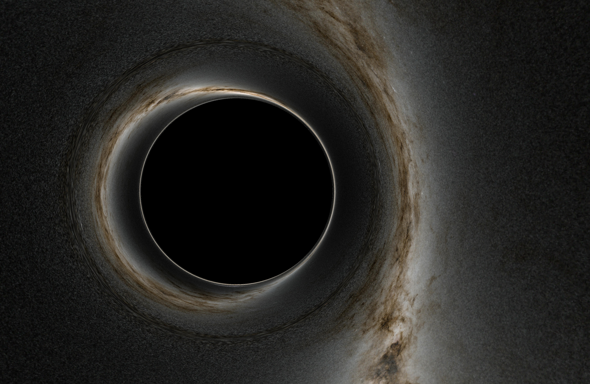

# Black Hole Diver
Black Hole Diver is a work-in-progress Schwarzschild black hole renderer for radially falling observers. The end goal is to have a video editing style program that can render still frames or animations of a trip into a black hole. 

*Black hole rendered using Black Hole Diver*

# Features
## Current
* Realtime viewport
* Timeline editor
* Image and animation rendering
* Perpective and 360° cameras

## Planned
* Custom HDRIs
* Save and load timeline sequences
* Custom radial asymptotic speed
* Light dopler shift

## Possible (but unlikely) Additions
* Kerr black holes
* Accretion  disks
* Arbitrary observer motion in spacetime
* Wormholes
